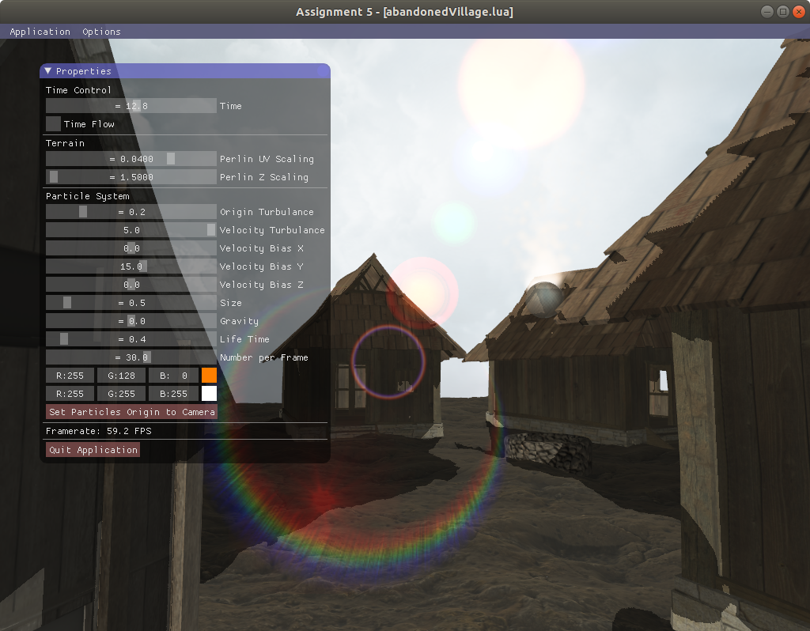

# CS488 OpenGL Project



## Compilation and Running

The compilation steps remain the same as the original steps.

In `A5` directory:

```
$ premake4 gmake
$ make
```


To run the program:


```
./A5 abandonedVillage.lua
```

## Input File Format

The file `scene_lua.cpp` from A3 has been modified to support textures and lightning.

To create a material with texture in the input lua script, for example:

```
gr.material(
	{0.85, 0.75, 0.6},
    {0.0, 0.0, 0.0},
    1.0,
    1.0,
    "trestraou1",
    2.0,
    { 0.5, 1.5, 60, 0.04 }
)
```

- The first argument is a 3-tuple representing the diffuse color, each component is from 0.0 to 1.0.
- The second argument is a 3-tuple representing the specular color, each component is from 0.0 to 1.0.
- The third argument is a number for the shininess of the material.
- The fourth argument is is the alpha value, from 0.0 to 1.0, for the transparency of the material.
- The fifth argument can be either `nil` or a string representing the texture name. The program will look for any texture - PNG file in `Assets/Textures` folder prefixed with the texture name. For example, if `trestrau1_NRM.png` exists, then  bump mapping will be available for the texture `trestrau1`, with the bump mapping bit being set to 1. If the argument has value `nil`, then this material will not have any texture.
- The sixth argument is a scaling factor for the UV coordinates for the texture. The larger the factor is, the more will the texture repeats.
- The seventh argument is a 4-tuple related to displacement. The first component is a number representing how severe the material will be affected by the displacement map texture (if a PNG texture file suffixed with `_DISP` is available). The second component representes how severe the material will be affected by the Perlin noise texture. The third component is the frequency for the Perlin texture. The fourth component is the UV scaling factor for the Perlin texture.

The material will be stored in `Material.hpp`.

To create a light, for example:

```
sunLight = gr.light({0, 0, 0, 0}, {1, 0.98, 0.9}, {1, 0.0, 0.0}, nil, nil)
rootNode:add_light(sunLight)
```

For creating light:
- The first argument is a `vec4` representing the position of the light. If the `w` component is `0`. This will become the direction of a parallel light.
- The second argument is the light color.
- The third argument is the attenuation parameters.
- The fourth argument is a number representing the cone angle for a spotlight. If it is a directional light, then it is `nil`. If it is a point light, set it to `180`.
- The fifth argument is a `vec3` representing the direction of the spotlight. It it is not a spotlight, then it is `nil`.

Otherwise, the lua methods are the same as in A3.

The file must contain a ground mesh named `ground` and the first light must be a parallel light. Only a maximum of 4 light sources are supported due to limitation of GLSL.

### Mesh Objects

The program will automatically find `.obj` files under `Assets/Objects`. Note that the mesh file must have the same object name `o <object_name>` as the first argument of `gr.mesh`.

The mesh object is exported from Blender. The options "Triangularize" and "Export UV" must be enabled.

### Textures

All the texture files must be 8-bit RGBA PNG files.

The `Texture object` supports 5 types of texture files: color (COL), normal (NRM), displacement (DISP), specular (SPEC) and ambient occlusion (OCC). Note that each of these may not be required, since it is not always possible to find complete set of textures. The texture files does not need to have the same size (for example we prefer larger resolution for displacement mapping), but they must have the same UV coordinates and must be square and have dimensions of power of 2.

## Interactions

The top menubar has different options to toggle visual effects and for debugging:

Name|Shortkey
---|---
Z-buffer 					    |CTRL+Z
Backface culling 			    |CTRL+B
Frontface culling			    |CTRL+F
Transparency				    |CTRL+T
Normal Shading			        |CTRL+N
UV Shading		    	        |CTRL+U
Tangent Shading			        |CTRL+G
Normal Mapping			        |CTRL+M
Tessellation	    		    |CTRL+S
Specular Mapping			    |CTRL+P
Ambient Occlusion Mapping	    |CTRL+A
Shadow	        		        |CTRL+H
Wireframe Mode	                |CTRL+W
Texture Mapping                 |CTRL+X
Free Mode                       |CTRL+R

If the "Free Mode" is on, the user can use WASD keys and mouse to move. Hold Shift to walk faster. To exit "Free Mode", use CTRL+R.

The panel has options to control the position of the sun, different parameters for the ground and for the particle system.

## Implementation

The project has been only tested in Ubuntu 16.04 LTS environment. The project has only used the original C++ dependencies like other CS 488 assignments.

The program uses lua scripts to setup the scene. The texture information is encapsulated in the `Texture` class. Once the texture is created in OpenGL, the texture ID is saved in this class. Every material may or may not have a texture, and every texture has a flag indicating which texture files are available so that the shader will do the sampling (or ignore) accordingly.

In order to achieve bump mapping, I modified the `MeshConsolidator` class to support parsing of texture coordinates. The calculation of tangent vectors are done in the geometry shader, since it is possible to access all the vertices forming the triangle in the shader.

Tessellation is used to demonstrate the Perlin noise, but also displacement mapping as extra feature. The idea is to define control points and the tesselation levels in the tessellation control shader, then evaluate the displacement in the tesselation evaluation shader using the hardware interpolated UV coordinates based on the texture. The tessellation level is calculated adaptively based on the distance from camera and the vertices, since we don't require many details for far objects. The PN-triangle technique is used to implement tessellation.

The particle system uses a `Particle` class that has the properties of a single particle such as position, velocity, gravity, lifetime, etc. At each call of `A5::appLogic()`, some particles are generated and some particles are deleted. Every particle is rendered using a dedicated shader. The particle is a square image always facing the camera. In order to achieve this, we make the product of View and Model to have the upper 3x3 matrix equal to identity matrix.

To implement the skybox, a cubemap texture is used. In order for the background to look far away, the view matrix has its fourth column adjusted to (0, 0, 0, 1) to eliminate the effect of translation.

The same technique for particle and skybox is used to implement the sun. In the project, the sun is represented by a square. It always faces the camera and appears very far away. The sun is drawn as a white circle with some transition of alpha (transparent) value, so that the center of the texture appears as an opaque circle, and the surrounding of sun are white semi-transparent. I have created a mathematical model to emulate the effect that by looking at the sun directly, the sun appears very bright and the shape is blurred (see `Assets/Shaders/Sun.frag`). This is done by modeling the decay of the alpha value from the surface of the sun to the border of the square.

Due to limitation of time and technical difficulties, there are several bugs and unimplemented features in the program:

1. The shadow appears very rough. The reason is that the orthogonal projection matrix uses fixed values to cast a frustum to the ground in order to create shadow map for all the objects. However, the texture resolution is limited. Thus the solution is to calculate the frustrum in the camera range so that the same texture map can be used for the shadow of smaller range of objects.

2. The tessellation has cracks. PN-AEN triangles from NVIDIA will solve this issue, (the idea is to average vertices of adjacent triangles so that an agreement can be made) however after many attempt I was not able to implement it.

3. The lens flare also shows if the sun appears behind an object. This is because the lens flare is implemented as a multiple textures on the viewport based on the angle between the camera vector and the direction from camera to the sun. A ray tracing from the camera to the sun might solve this issue.

4. Transparent material using alpha channel is not perfect. Although I have drawn the opaque object first, I have not drawn the triangles in the same transparent model from farthest to the closest.

5. The reflection map currently only reflects the skybox texture. In order to reflect other objects in the scene in realtime, an environment map must be created in real time by rendering the scene to another framebuffer.

## Code Structure
The project was based on the Assignment 3 code. The important part is that in the `draw()` function, the functions `renderShadowMap()`, `renderSceneGraph()`, `renderSkybox()`, `renderParticles()`, `renderSun()`, `renderLensFlare()` are called in order. Cubemaps, shadowmaps, textures, light sources are initialized in the `init()` function.

## References
Shreiner, Dave. <i>OpenGL programming guide : the official guide to learning OpenGL, version 2.</i> Upper Saddle River, NJ: Addison-Wesley, 2006. Print.

Vlachos, Alex. <i>Curved PN Triangles.</i> University Of Florida, 2018, https://alex.vlachos.com/graphics/CurvedPNTriangles.pdf. Accessed 6 July 2018.

## Acknowledgements

I want to thank our course TA Mark Iwanchyshyn for helping me cleaning the bugs in my code.

The following websites has supplied me with free models and textures:
https://www.turbosquid.com/
http://www.virtual-lands-3d.com/textures.html

To implement Perlin noise in my project, I referred to Perlin's reference implementation in Java that can be found in his homepage.
